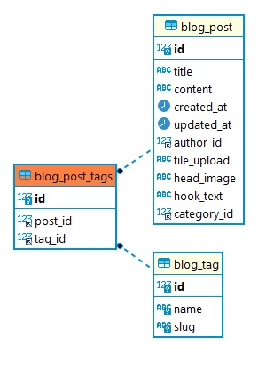

- [데이터 필드](https://docs.djangoproject.com/ko/4.2/ref/models/fields/#field-types)

# 1. 게시판 모델 생성
1. 먼저 `django_prj/settings.py`파일에서 `INSTALLED_APPS`를 기술해야한다.
1. 모델 클래스 작성, `django_prj/blog/models.py`
   ```py
   class Post(models.Model):
   title = models.CharField(max_length=50) # 제목
   content = models.TextField() # 내용
   create_at = models.DateTimeField() # 작성일

   def __str__(self):
      return f'[{self.pk} {self.title}]'
      # 관리자 페이지에 등록된 모델인 경우 해당 모델의 게시판에서 PostOject(pk) 대신 반환값으로 보여지게 된다.
   ```
   - `class Post(models.Model)`: Post 엔티티 클래스

1. 모델 클래스 반영
   ```console
   > python manage.py makemigrations
   blog/migrations/0001_initial.py
    - Create model Post
   ```
   - `blog/migrations/0001_initial.py`에 `models.py`에 작성한 클래스 기반으로 기술된다.

1. 데이터 베이스에 테이블 생성
   ```console
   > python manage.py migrate
   Applying ... OK
   Applying blog.0001_initial... OK
   Applying sessions.0001_initial... OK
   ```
   - 데이터 베이스에 테이블이 생성된다.

# 2. 기본키 세팅
- 장고 모델에서 PK를 정의하지 않으면, 자동으로 ID 필드를 생성하고 이를 PK로 사용한다. ID 필드는 정수형이며, 자동으로 증가한다.

# 3. [ORM 메서드](https://docs.djangoproject.com/ko/4.2/topics/db/queries/)

## 📌조회(Select)
- `all()`: 모든 데이터 반환
   ```py
   Entity.objects.all()
   ```
- `filter()`: 필터링된 결과를 가져오기
   ```py
   Entity.objects.filter(category='news')
   ```
- `filter(field__range=(start_data, end_data))`: 범위 조회
   ```py
   Entity.objects.filter(created_at__range=(start_data, end_data)) # 특정 기간 동안 객체 조회
   ```
- `get()`: 단일 객체 가져오기
   ```py
   Entity.objects.get(condition)
   ```
- `order_by()`: 정렬
   ```py
   Entity.objects.all().order_by('pk') # asc
   Entity.objects.all().order_by('-pk') # desc
   Entity.objects.order_by('-create_at') # 작성일 기준 내림차순으로 정렬된 객체 조회
   ```
- `count()` : 조건을 만족하는 객체 개수 조회
   ```py
   Entity.objects.filter(category=None).count()
   ```
- `[n:m]`: 일부 객체만 조회(페이징)
   ```py
   Entity.objects.all()[:10]
   ```
- `values('field')`: 특정 필드만 선택해서 조회
   ```py
   Entity.objects.values('field')
   ```
- `distinct()`: 중복된 객체 제거
   ```py
   Entity.objects.values('field').distinct()
   ```

## 📌수정(Update)
- `save()`: 데이터 변경사항 저장
   ```py
   entry = Entry.objects.get(id=1)
   entry.title = 'title to change'
   entry.content = 'content to change'
   entry.save()
   ```

## 📌삭제(Delete)
-`delete()`: 데이터 삭제
   ```py
   entry = Entry.objects.get(id=1)
   entry.delete()
   ```

# 4. Many to Many Ralation
모델의 여러 레코드가 다른 모델의 여러 레코드에 연결될 수 있는 관계이다.
- `django_prj/blog/models.py`
   ```py
   class Entity(models.Model):
      tags = models.ManyToManyField(Tag, blank=True)

   class Tag(models.Model):
      name = models.CharField(max_length=50, unique=True)
      slug = models.SlugField(max_length=200, unique=True, allow_unicode=True)
   ```
   - 
   - `Post` 객체는 `tags`를 통해 연결된 태그들을 가져올 수 있다.
      ```py
      entity = Entity.objects.get(id=1)
      entity.tags.all()
      ```
   - `tag.entityname_set`를 이용해 `Tag` 객체와 연관된 entity 객체를 반환 받을 수 있다.
      ```py
      tag = Tag.objects.get(id=1)
      entitys = tag.entityname_set.all()
      ```
   - 역 참조 매니저를 통해 N:N 관계를 역방향으로 조회할 수 있으며, 필요에 따라 역참조 매니저의 이름을 직접 설정할 수 있다.