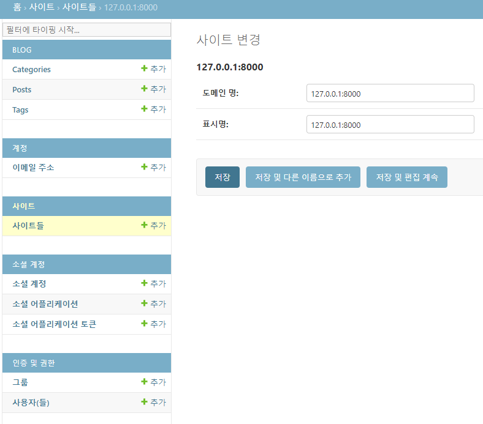
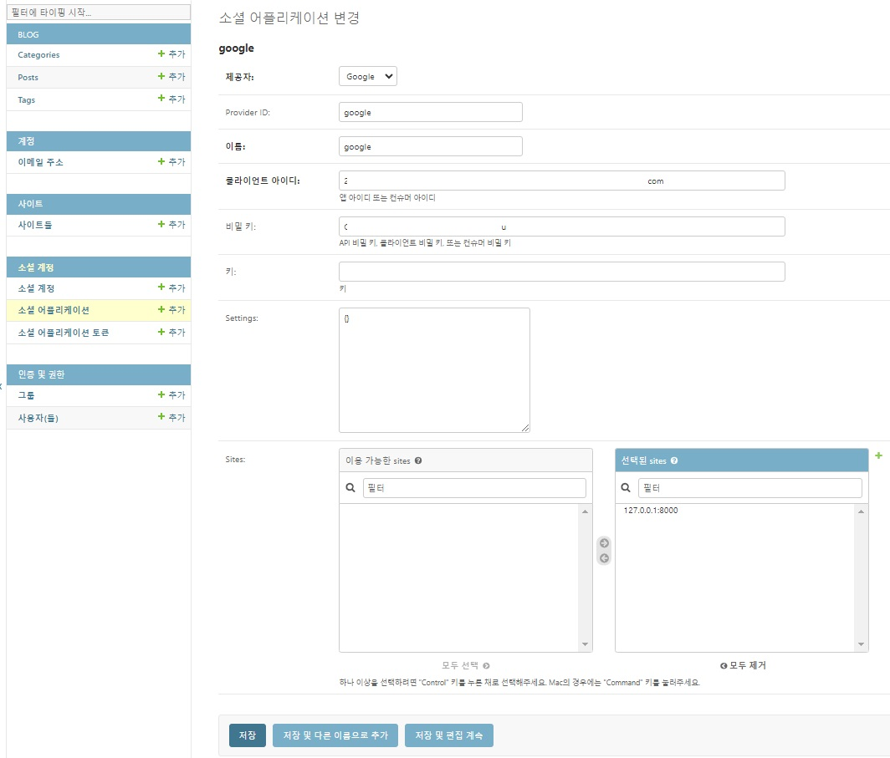

# 1. OAuth
- 사용자가 웹 애플리케이션 또는 모바일 웹에 Google와 같은 계정을 사용하여 로그인할 수 있도록 인증 및 권한 부여 프로토콜이다.
- 애플리케이션이 사용자의 Google 계정에 대한 전급 권한을 요청하고 사용자 동의할 경우에만 애플리케이션이 해당 권한을 얻을 수 있도록 해준다.

# 2. [django-allauth](https://docs.allauth.org/en/latest/installation/quickstart.html) 설정

- 라이브러리 설치
   ```console
   pip install django-allauth
   ```

- `/django_prj/settings.py`
   ```py
   INSTALLED_APPS = [
      'django.contrib.sites',
      'allauth',
      'allauth.account',
      'allauth.socialaccount',
      # ... include the providers you want to enable:
      'allauth.socialaccount.providers.google', # 구글
   ]

   AUTHENTICATION_BACKENDS = [
      # Needed to login by username in Django admin, regardless of `allauth`
      'django.contrib.auth.backends.ModelBackend',
      # `allauth` specific authentication methods, such as login by email
      'allauth.account.auth_backends.AuthenticationBackend',
   ]

   MIDDLEWARE = [
      # Add the account middleware
      "allauth.account.middleware.AccountMiddleware",
   ]

   # Email 주소 수집 여부
   ACCOUNT_EMAIL_REQUIRED = True
   # 회원 가입 시 Email 가입 여부 체크 없이 가입
   ACCOUNT_EMAIL_VERIFICATION = 'none'
   # 소셜 로그인 요청이 Get메서드로 처리
   SOCIALACCOUNT_LOGIN_ON_GET = True

   SITE_ID = 1
   ```

- `django_prj/urls.py`
   ```py
   from django.urls import path, include
   
   urlpatterns = [
      path('accounts/', include('allauth.urls')),
   ]
   ```

- DB 테이블 생성
   ```console
   python manage.py migrate
   ```

# 3. [Google Cloud](https://console.developers.google.com/)에서 OAuth 설정

1. 로그인
1. 구글 클라우드에서 새 프로젝트 생성
1. 만들어진 프로젝트에서 *API 및 서비스* 메뉴 진입
1. `OAuth consent secreen` 메뉴 진입 후, 외부 선택한 후 만들기 선택
1. 앱 등록 수정 절차 진행
   - 필수사항(`*`) 입력란에 입력(앱 이름, 사용자 지원 이메일 입력, 개발자 연락처& 이메일)
   - 입력 후, *저장 후 계속* 클릭.(이후에 나오는 항목 특이 사항 없으면 계속 클릭하여 넘김.)
1. *사용자 인증 정보 메뉴* 진입
1. *OAuth 클라이언트 ID 만들기* 선택
   - 애플리케이션 유형 : 웹 애플리케이션
   - 이름 : 프로젝트 명
   - 승인된 자바스크립트 원본 : URI1 `http://127.0.0.1:8000`
   - 승인된 리디렉션 URI : URI1 `http://127.0.0.1:8000/accounts/google/login/callback/`
   - 만들기 클릭

# 4. Django Admin Page
1. `sties` 변경
1. 도메인명, 표시명을 변경
   - 
1. 소셜 어플리케이션 추가
   - 
   - 제공자, 이름, 클라이언트 ID, 비밀 키(생성된 경우..) 기술

# 5. html
```html



   <div>{{ user.username }}</div>

   <a role="button" href=""type="button">
      Google Login
   </a>

```